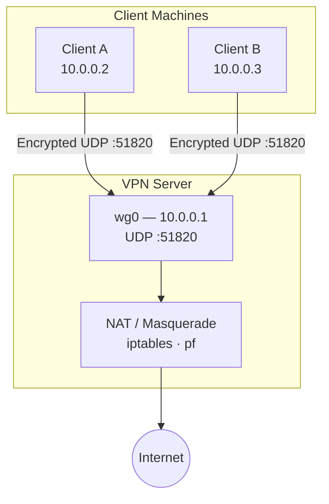
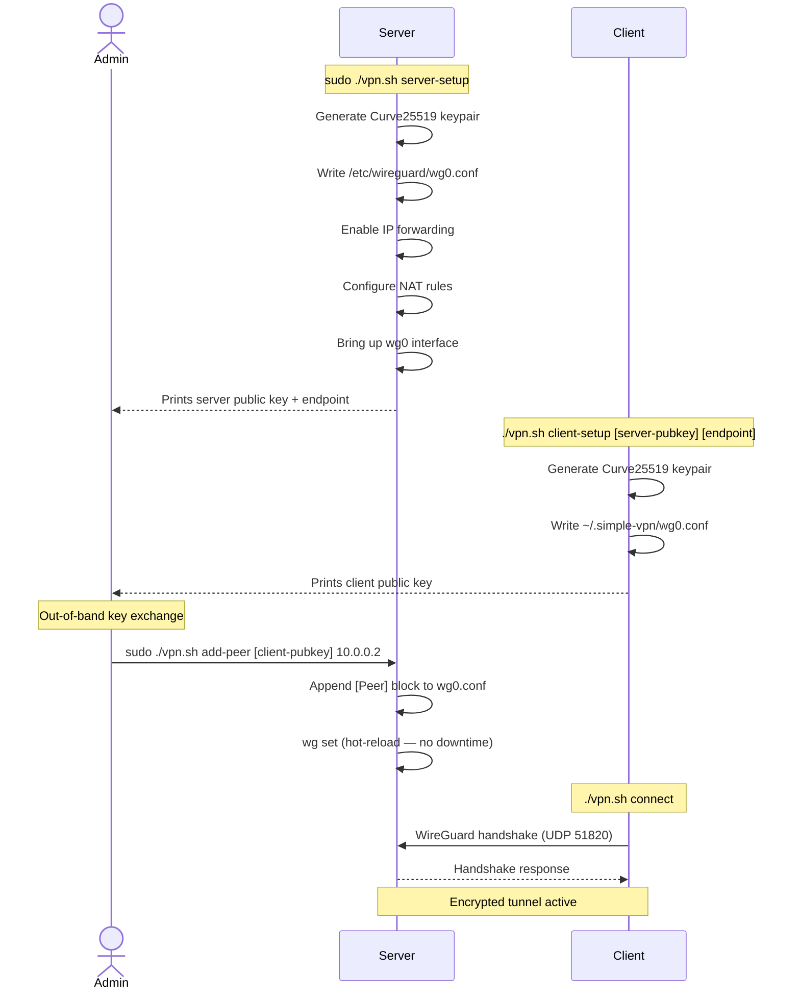

# simple-vpn

A terminal-based WireGuard VPN tool. Stand up a VPN server and connect clients entirely from the command line — no GUI, no cloud dashboard, no subscription.

---

## Purpose

simple-vpn wraps [WireGuard](https://www.wireguard.com/) in a set of shell scripts that handle the repetitive, error-prone parts of VPN setup:

- Generating Curve25519 keypairs
- Writing correctly formatted `wg0.conf` files
- Enabling IP forwarding and configuring NAT rules (iptables on Linux, pf on macOS)
- Hot-reloading peer configuration without dropping active connections
- Managing IPv6 on macOS to prevent leaks when using full-tunnel mode

The goal is to make self-hosted VPN accessible without sacrificing transparency — every script is readable bash, with inline comments explaining *why* each step exists.

---

## Design

### Architecture



### Setup Sequence



### Tunnel Modes

| Mode | AllowedIPs | Traffic routed through VPN |
| --- | --- | --- |
| **Full tunnel** (default) | `0.0.0.0/0, ::/0` | All traffic — maximum privacy |
| **Split tunnel** | `10.0.0.0/24` | Only VPN subnet traffic — faster for general browsing |

### How WireGuard Works

WireGuard is a modern VPN protocol built into the Linux kernel. Key properties:

- **Keypairs**: Each peer has a Curve25519 keypair. Public keys are exchanged to establish trust, similar to SSH `authorized_keys`. Private keys never leave the machine that generated them.
- **UDP tunnel**: All traffic is encapsulated in encrypted UDP packets. No TCP overhead.
- **Cryptography**: ChaCha20 for symmetric encryption, Poly1305 for authentication, BLAKE2s for hashing, Curve25519 for key exchange.
- **Stealth**: Unknown peers are silently dropped — the server is invisible to port scanners.
- **Roaming**: Clients can switch networks (WiFi → cellular) and the tunnel automatically resumes.

---

## Script Structure

```
simple-vpn/
├── vpn.sh              # Entry point — parses commands, dispatches to subscripts
├── server.sh           # Server setup: keygen, wg0.conf, NAT, interface management
├── client.sh           # Client setup: keygen, wg0.conf, connect/disconnect
├── vpn-cleanup.sh      # Gracefully stops all WireGuard interfaces
└── .gitignore          # Excludes private keys, runtime configs, dev scripts
```

At runtime, simple-vpn creates:

| Path | Contents |
| --- | --- |
| `~/.simple-vpn/` | Keypairs and config copies (700 permissions, user-owned) |
| `/etc/wireguard/wg0.conf` | Active WireGuard config (600 permissions, root-owned) |

Private keys are written with `chmod 600` and never printed to the terminal.

---

## Prerequisites

Install WireGuard tools for your OS:

```bash
# Ubuntu / Debian
sudo apt install wireguard

# Fedora
sudo dnf install wireguard-tools

# Arch
sudo pacman -S wireguard-tools

# macOS
brew install wireguard-tools
```

---

## Quick Start

### 1. Server Setup

On your server machine (VPS, cloud instance, or any Linux/macOS host):

```bash
sudo ./vpn.sh server-setup
```

Note the **server public key** and **server IP:port** (default port: 51820) printed at the end.

### 2. Client Setup

On your laptop or any other device:

```bash
# Full tunnel — routes ALL traffic through VPN
./vpn.sh client-setup <server-public-key> <server-ip>:51820

# Split tunnel — only routes traffic destined for the VPN subnet
./vpn.sh client-setup <server-public-key> <server-ip>:51820 10.0.0.2/24 split
```

Note the **client public key** printed at the end.

### 3. Register the Client on the Server

Back on the server, add the client as a peer:

```bash
sudo ./vpn.sh add-peer <client-public-key> 10.0.0.2
```

This hot-reloads without restarting the interface or dropping existing connections.

### 4. Connect

On the client:

```bash
./vpn.sh connect
```

### 5. Verify

```bash
# Check VPN status
./vpn.sh status

# Ping the server through the VPN
ping 10.0.0.1

# Confirm public IP is now the server's (full tunnel mode)
curl ifconfig.me
```

### 6. Disconnect

```bash
./vpn.sh disconnect
```

---

## Adding More Clients

Each client needs a unique VPN IP. Repeat steps 2–4 with incrementing IPs:

```bash
# Client 2:
./vpn.sh client-setup <server-pubkey> <server-ip>:51820 10.0.0.3/24

# On server:
sudo ./vpn.sh add-peer <client2-pubkey> 10.0.0.3
```

---

## Commands Reference

### Server Commands (run with `sudo` on the server)

| Command | Description |
| --- | --- |
| `sudo ./vpn.sh server-setup` | Generate keys, configure, and start the VPN server |
| `sudo ./vpn.sh add-peer <pubkey> <vpn-ip>` | Add a new client (hot-reload, no downtime) |
| `./vpn.sh server-status` | Show active peers and transfer stats |

### Client Commands

| Command | Description |
| --- | --- |
| `./vpn.sh client-setup <pubkey> <endpoint:port> [ip] [full\|split]` | Configure this machine as a client |
| `./vpn.sh connect` | Bring up the VPN tunnel |
| `./vpn.sh disconnect` | Bring down the VPN tunnel |
| `./vpn.sh status` | Show connection status and transfer stats |
| `./vpn.sh keys` | Generate or display this client's keypair |

---

## Troubleshooting

**"WireGuard tools not found"** — Install `wireguard-tools` for your OS (see Prerequisites).

**"Server setup requires root"** — Run with `sudo`: `sudo ./vpn.sh server-setup`.

**Client can't connect:**

1. Verify the server's UDP port 51820 is open in your firewall / cloud security group.
2. Confirm the client's public key was added as a peer on the server (`add-peer`).
3. Check the server endpoint IP and port are correct.

**DNS not resolving in full tunnel mode** — The config sets DNS to `1.1.1.1` (Cloudflare). Edit `~/.simple-vpn/wg0.conf` and re-run `connect` to change it.

**Connection drops behind NAT** — `PersistentKeepalive = 25` is set by default, which keeps most NAT mappings alive. Increase to `60` if still dropping.

**macOS: IPv6 leak warnings** — `client.sh` disables IPv6 on all network services when connecting in full tunnel mode and re-enables it on disconnect.

---

## Security Notes

- **Private keys** are stored in `~/.simple-vpn/` with `chmod 600` and never leave the local machine.
- The `/etc/wireguard/wg0.conf` on the server contains the server private key and is `chmod 600`, root-owned.
- Never commit `*.key` files or `wg0.conf` configs containing real private keys — these are excluded in `.gitignore`.
- Public keys are safe to share; they are used only to verify peer identity and cannot be used to decrypt traffic.

---

## Alternatives

### VPS Providers (where to run the server)

| Provider | Notes |
| --- | --- |
| **[UpCloud](https://upcloud.com)** | Recommended. Fast NVMe storage, simple pricing, good EU/US coverage. The $7/mo "1 CPU / 1 GB" plan is more than enough for a personal VPN server. Supports cloud-init for automated setup. |
| [Hetzner](https://www.hetzner.com/cloud) | Excellent price-to-performance in Europe (Frankfurt, Helsinki). CX11 (~€4/mo) is sufficient. Popular for self-hosted tooling. |
| [Vultr](https://www.vultr.com) | Wide region selection including APAC. $6/mo High Frequency tier recommended over the shared compute tier. |
| [DigitalOcean](https://www.digitalocean.com) | Beginner-friendly with good documentation. $6/mo Droplet works fine; slightly pricier than Hetzner for equivalent specs. |
| [Linode / Akamai](https://www.linode.com) | Solid performance, long track record. Nanode ($5/mo) is sufficient for personal use. |

> **Tip for UpCloud:** Enable the "Utility network" (private VLAN) if you want to keep VPN traffic separate from your server's public bandwidth quota. WireGuard runs well on their default Ubuntu 22.04 LTS image with no extra configuration.

### WireGuard Management Tools (alternatives to this script)

| Tool | Type | Best for |
| --- | --- | --- |
| [wg-easy](https://github.com/wg-easy/wg-easy) | Docker web UI | Quick single-server setup with a browser dashboard |
| [Tailscale](https://tailscale.com) | Managed WireGuard | Zero-config mesh networking; no server required, but uses Tailscale's coordination server |
| [Headscale](https://github.com/juanfont/headscale) | Self-hosted Tailscale | Self-hosted coordination server for Tailscale clients; keeps full control |
| [Algo VPN](https://github.com/trailofbits/algo) | Ansible playbook | Automated server provisioning to DigitalOcean/AWS/etc. with hardened defaults |
| [Netbird](https://netbird.io) | Managed WireGuard mesh | Peer-to-peer mesh (no traffic through server); open-source with self-hosted option |

### VPN Protocol Alternatives

| Protocol | Notes |
| --- | --- |
| **WireGuard** (this tool) | Modern, fast, ~4,000 lines of auditable kernel code. Best default choice. |
| [OpenVPN](https://openvpn.net) | Mature, widely supported, works over TCP (useful when UDP is blocked). More complex config. |
| [IKEv2 / IPSec](https://github.com/hwdsl2/setup-ipsec-vpn) | Native on iOS/macOS/Windows without extra apps. Good for mobile-first setups. |
| [Nebula](https://github.com/slackhq/nebula) | Overlay mesh network from Slack. Better suited for connecting many services across data centers than a personal VPN. |
